<div align="center">



<br/>

[](LICENSE)


**Plataforma de declaración de renta para personas naturales en Colombia.**
El usuario sube su exógena y certificados, la IA extrae los datos y conduce una
entrevista, y un **motor fiscal 100 % determinista** liquida el formulario 210.

</div>

---

> [!IMPORTANT]
> **La IA lee, el código calcula.** Los documentos se leen dos veces con IA y el
> usuario confirma cada valor; el impuesto lo calcula un motor auditado cuyas
> reglas **citan la norma que las respalda** ([`normativa/`](normativa/)). La IA
> nunca decide un número fiscal — solo transcribe y explica.

<br/>

<div align="center">

</div>

## ✦ Cómo funciona

| Paso                | Qué pasa                                                                                                              | Quién manda      |
| ------------------- | --------------------------------------------------------------------------------------------------------------------- | ---------------- |
| **1. Documentos**   | El usuario carga su exógena (reporte de terceros) y sus certificados (laboral, bancario, medicina prepagada…).        | Usuario          |
| **2. Extracción**   | Un LLM multimodal lee cada documento **dos veces** y propone los valores; la exógena guía qué certificados faltan.    | IA (propone)     |
| **3. Confirmación** | El usuario revisa y confirma cada dato en una entrevista conversacional.                                              | Usuario (decide) |
| **4. Liquidación**  | El motor determinista arma el `PerfilFiscal` y calcula el **formulario 210** casilla por casilla.                     | Código (calcula) |
| **5. Resultado**    | Borrador explicado (impuesto o saldo a favor) con el desglose por cédula e instrucciones para presentarlo en la DIAN. | Usuario          |

<br/>

<div align="center">

</div>

## ✦ Arquitectura (hexagonal / puertos y adaptadores)

El dominio fiscal es **puro y sin dependencias**; todo lo externo (IA, base de
datos, navegador, HTTP) entra por adaptadores que implementan los puertos de
`@turenta/core`. Las dependencias siempre **apuntan hacia el dominio**.

```
apps/web  ─▶  @turenta/core  ─▶  @turenta/motor-fiscal   (dominio puro, 0 deps)
                   ▲
      @turenta/adaptadores   (LLM OpenAI-compatible · parsers · Prisma · storage)
```

| Paquete                                          | Responsabilidad                                                                                                |
| ------------------------------------------------ | -------------------------------------------------------------------------------------------------------------- |
| [`packages/motor-fiscal`](packages/motor-fiscal) | Liquidación del formulario 210. Dominio puro, auditable, cero dependencias.                                    |
| [`packages/core`](packages/core)                 | Puertos (interfaces), tipos del dominio y reglas de negocio de aplicación.                                     |
| [`packages/adaptadores`](packages/adaptadores)   | Implementaciones: extracción con IA, parsers de documentos, persistencia (Prisma), storage, generación de PDF. |
| [`packages/shared`](packages/shared)             | Tipos y utilidades compartidas.                                                                                |
| [`apps/web`](apps/web)                           | Next.js (App Router) — UI y API routes como adaptador de entrada.                                              |
| [`apps/worker-dian`](apps/worker-dian)           | Automatización DIAN aislada (Playwright).                                                                      |

Las fronteras **se hacen cumplir de dos formas**: ESLint (`import/no-restricted-paths`

- `no-restricted-imports`) y **tests de arquitectura** ([`test/arquitectura.test.ts`](test/arquitectura.test.ts))
  que fallan la CI si una capa importa lo que no debe.

<br/>

<div align="center">

</div>

## ✦ Automatización DIAN

La descarga de la exógena desde el portal MUISCA corre en un **worker aislado**
con Playwright, separado de la aplicación:

- La credencial DIAN viaja **cifrada (AES-256-GCM)**; la clave vive **solo** en el
  worker y el texto cifrado **solo** en la base — ninguna mitad basta por sí sola.
- El worker abre una **sesión efímera**, descarga la exógena y la cierra. No
  guarda la contraseña ni la registra en logs.
- Corre con límites de memoria y concurrencia acotada para que un pico de
  Chromium no tumbe la base de datos.

## ✦ Características

- 🧮 **Motor fiscal determinista** — mismas entradas, misma salida; cada constante
  cita su fuente normativa en [`normativa/`](normativa/).
- 🤖 **Extracción con IA intercambiable** — adaptador OpenAI-compatible genérico:
  cambiar de proveedor es cambiar tres variables de entorno.
- 🔒 **Seguridad por diseño** — OTP por correo, sesión JWT firmada, credenciales
  DIAN cifradas, cabeceras endurecidas (CSP, HSTS), rate-limiting por IP real.
- 🎨 **Tema claro / oscuro / auto** — configurable desde ajustes.
- 📄 **Formulario 210 real** — genera el borrador sobre la plantilla oficial.
- ✅ **Golden test** — reproduce una declaración real, casilla por casilla.

## ✦ Stack tecnológico

`TypeScript` · `Next.js 16` (App Router, React) · `Tailwind CSS v4` ·
`Prisma` + `PostgreSQL` · `Playwright` · `Vitest` · monorepo `pnpm` + `Turborepo` ·
LLM vía API OpenAI-compatible.

## ✦ Puesta en marcha

```bash
pnpm install

pnpm test          # tests de paquetes + tests de arquitectura
pnpm lint          # reglas estrictas (max-depth 1, capas enforced)
pnpm typecheck

docker compose up -d                     # PostgreSQL local
pnpm --filter @turenta/adaptadores db:push   # aplica el esquema
pnpm --filter web dev                    # app en modo desarrollo
```

Los secretos van en `.env.local` (nunca se commitea). Variables principales:

| Variable                                          | Uso                                                      |
| ------------------------------------------------- | -------------------------------------------------------- |
| `DATABASE_URL`                                    | Conexión a PostgreSQL. **Requerida.**                    |
| `AUTH_SECRET`                                     | Firma de la sesión JWT (≥ 32 caracteres). **Requerida.** |
| `OPENCODE_API_KEY` · `LLM_BASE_URL` · `LLM_MODEL` | Proveedor de IA (OpenAI-compatible).                     |
| `BREVO_API_KEY` · `EMAIL_FROM_ADDRESS`            | Correos de OTP y vencimientos.                           |
| `WORKER_DIAN_TOKEN` · `DIAN_CRED_KEY`             | Autenticación y cifrado del worker DIAN.                 |

## ✦ El golden test

[`packages/motor-fiscal/test/caso-dorado.test.ts`](packages/motor-fiscal/test/caso-dorado.test.ts)
reproduce una **declaración real AG2025 de referencia**, casilla por casilla. Es
la garantía de exactitud del motor:

> **Si un cambio rompe el golden test, el cambio está mal** — o hay una decisión
> normativa nueva que primero se documenta en [`normativa/`](normativa/).

El E2E ([`packages/adaptadores/test/e2e`](packages/adaptadores/test/e2e)) va más
allá: ingiere documentos reales con el LLM y verifica que **documentos → motor**
produzcan el mismo resultado de referencia.

## ✦ Despliegue

Imagen de producción multi-stage con salida `standalone` de Next.js. El stack
completo (web + worker DIAN + PostgreSQL) se levanta con Docker Compose y se
publica detrás de un proxy/túnel que termina el TLS:

```bash
docker compose -f docker-compose.do.yml up -d --build
```

La integración continua ([`.github/workflows`](.github/workflows)) redespliega en
cada push a `main`. Requisitos mínimos: `DATABASE_URL` y `AUTH_SECRET`; antes del
primer arranque, aplica el esquema con `db:push`.

## ✦ Documentación

- [`normativa/`](normativa/README.md) — fuentes normativas por año gravable (respaldo de las constantes del motor).
- [`research/`](research/README.md) — investigación (normativa, exógena, integración DIAN, mercado, IA).
- [`PLAN-DESARROLLO.md`](PLAN-DESARROLLO.md) · [`PLAN-DIAN.md`](PLAN-DIAN.md) — plan por fases y decisiones de arquitectura.

## ✦ Licencia

[PolyForm Noncommercial License 1.0.0](LICENSE) — código disponible para uso
personal, educativo, de investigación y sin ánimo de lucro. La explotación
comercial está reservada al titular del copyright ([detalles](NOTICE.md)).

<div align="center">
<br/>
<sub>Hecho con ⚖️ y código determinista · © 2026 Kevin Bayter</sub>
</div>
